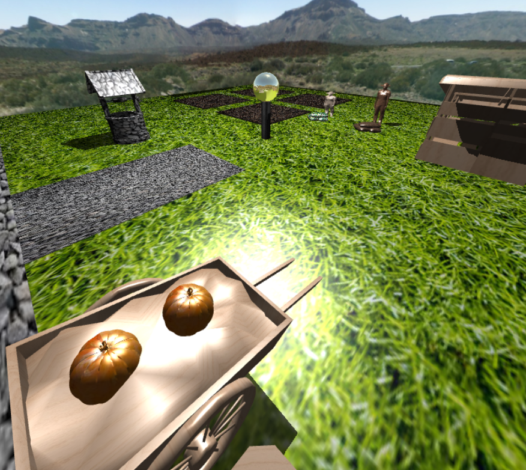
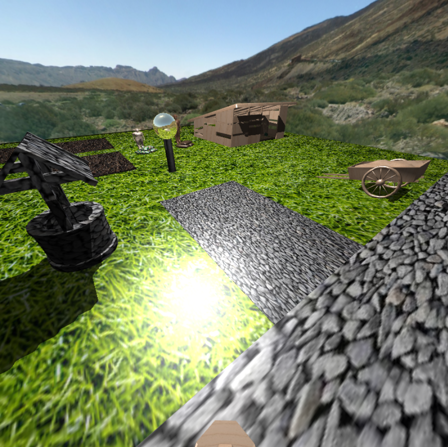

# 南瓜農場 3D 互動式遊戲

這是一個使用 **WebGL** 實作的 3D 農場遊戲作業，玩家可以在虛擬農場中耕種、灌溉、施肥並收穫南瓜，最後將南瓜放到推車上換取金錢。

[試玩網址(第一次進去圖案渲染很久是正常的)](https://heyimwei.github.io/3D_Interactive_Game/)

---

## 1. 專案簡介

- **主要功能**：  
  1. 角色可拿取種子、肥料、水壺等物品並在田地進行播種、澆水、施肥。  
  2. 南瓜成熟後可收成並放到推車上；當推車滿載一定數量(2個)的南瓜後可推走「賣錢」。  
  3. 支援第一人稱視角與第三人稱視角的切換。  
  4. 部分物件（角色、農具、建築等）以 `.obj` 模型載入，並且搭配多張 `.jpg` 做為材質。

- **開發技術**：  
  - 使用 WebGL (原生 JavaScript) 繪製 3D 場景  
  - 參考了 `cuon-matrix.js` 變換運算函式庫  
  - 以 `OBJ` 模型檔和對應的材質貼圖實現遊戲中的角色、道具、場景物件

---

## 2. 檔案說明

- **index.html**  
  - 遊戲主頁，載入必要的腳本與 `<canvas>`。  
  - 內含遊戲操作說明（WASD、視角切換、抓取放置物品等）。  
  - 透過 `onload="main()"` 呼叫主要遊戲初始化函式。

- **WebGL.js**  
  - 主要的 WebGL 初始化與繪製程式碼。包含：  
    - Vertex/Fragment Shader (含投影、陰影、反射等光線計算)。  
    - 讀取並解析 OBJ 模型 (`parseOBJ` 函式)。  
    - 繪製流程：先在 Framebuffer 中渲染 Shadow Map，再進行場景繪製。  
    - 角色互動（按鍵事件、物品抓取與放置、植物成長、鏡頭移動等）。

- **cuon-matrix.js**  
  - 矩陣與向量運算函式庫，用於簡化 WebGL 中的矩陣與向量操作。

- **多個 .obj 模型與貼圖**  
  - 模型與貼圖主要用於角色、農具、場景、物件等 3D 外觀。

---

## 3. 執行環境與安裝方式

1. **瀏覽器支援**：  
   - 需使用支援 WebGL 的現代瀏覽器。  
   - 建議使用桌面瀏覽器以確保滑鼠與鍵盤操控正常運作。

2. **本地伺服器 (建議)**：  
   - 由於部分瀏覽器限制，直接開啟本地 `index.html` 可能遇到跨域（CORS）問題而無法載入外部模型或貼圖。  
   - 啟動伺服器後，在瀏覽器進入 `http://localhost:8080/index.html` 即可啟動遊戲。

---

## 4. 操作方式與遊戲流程

### 4.1 角色移動
- **W / A / S / D** ：向 前 / 左 / 後 / 右 移動  

### 4.2 視角切換
- **Z**：切換第三人稱視角  
- **X**：切換第一人稱視角  

### 4.3 物品互動 (皆需角色貼近物品)  
- **G**：抓取物品 
- **H**：放下物品或將收成放到推車  
- **E**：對物品進行互動（澆水、施肥）  

### 4.4 遊戲流程示例
1. **拿起種子**：靠近種子按 G  
2. **播種**：走到田地按 E 放下種子  
3. **裝水**：按 G 拿水壺並靠近水井，按下 E 裝水  
4. **澆水**：拿著水壺走到已播種的田地按 E  
5. **施肥**：同理，拿肥料到田地按 E  
6. **收成南瓜**：成熟後靠近按 G 拿起南瓜  
7. **將南瓜放到推車**：靠近推車按 H 放下南瓜  
8. **販賣**：累積收成兩顆南瓜後，按 Q 推動推車離開，完成任務

---

## 5. 程式碼架構簡述

**main()**  
- 主要進入點：初始化 WebGL、載入著色器、讀取 OBJ 與貼圖、綁定事件監聽。  

**Shadow Mapping 流程**  
1. 將場景渲染到FrameBuffer。  
2. 再切回預設 FrameBuffer，以該深度貼圖進行陰影判斷，渲染最終場景。

**事件監聽 (Keyboard & Mouse)**  
- WASD 移動、Z/X 切視角、G/H/E/Q 等互動邏輯。  
- 滑鼠拖曳可改變視角旋轉。

**載入 OBJ**  
- 將 `.obj` 檔的文字資料解析為頂點、法向量、UV座標。  
- 再將解析後資料轉為可交給 WebGL 繪製的 VBO。

**碰撞或距離判斷**  
- 用角色與物件的 `x, y, z` 計算歐幾里得距離，若小於閾值則判定「可抓取」或「可互動」。
